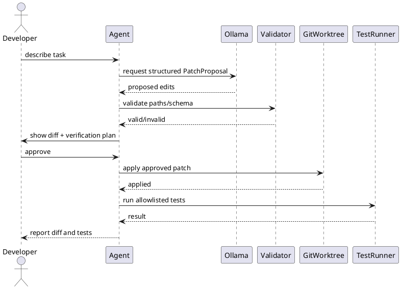

# Future Edit Workflow UML

```plantuml
@startuml
actor Developer
participant Agent
participant Ollama
participant Validator
participant GitWorktree
participant TestRunner

Developer -> Agent: describe task
Agent -> Ollama: request structured PatchProposal
Ollama --> Agent: proposed edits
Agent -> Validator: validate paths/schema
Validator --> Agent: valid/invalid
Agent -> Developer: show diff + verification plan
Developer -> Agent: approve
Agent -> GitWorktree: apply approved patch
GitWorktree --> Agent: applied
Agent -> TestRunner: run allowlisted tests
TestRunner --> Agent: result
Agent --> Developer: report diff and tests
@enduml
```

This workflow is intentionally not implemented yet. The MVP stops before patch application and test execution.
