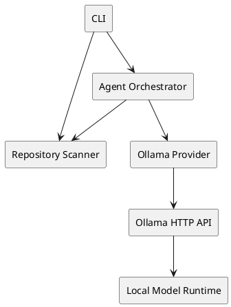
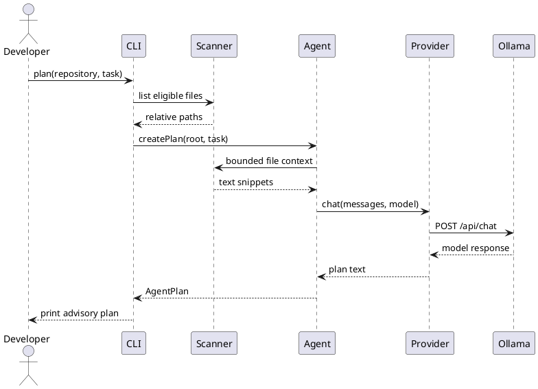

# UML

## Component diagram

```plantuml
@startuml
skinparam componentStyle rectangle
[CLI] --> [Agent Orchestrator]
[CLI] --> [Repository Scanner]
[Agent Orchestrator] --> [Ollama Provider]
[Agent Orchestrator] --> [Repository Scanner]
[Ollama Provider] --> [Ollama HTTP API]
[Ollama HTTP API] --> [Local Model Runtime]
@enduml
```

## Sequence diagram: plan

```plantuml
@startuml
actor Developer
participant CLI
participant Scanner
participant Agent
participant Provider
participant Ollama
Developer -> CLI: plan(repository, task)
CLI -> Scanner: list eligible files
Scanner --> CLI: relative paths
CLI -> Agent: createPlan(root, task)
Agent -> Scanner: bounded file context
Scanner --> Agent: text snippets
Agent -> Provider: chat(messages, model)
Provider -> Ollama: POST /api/chat
Ollama --> Provider: model response
Provider --> Agent: plan text
Agent --> CLI: AgentPlan
CLI --> Developer: print advisory plan
@enduml
```
